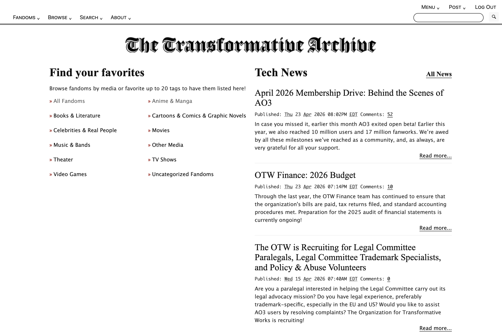

# Custom AO3 Site Skin

A heavily restyled skin for [Archive of Our Own](https://archiveofourown.org/) that gives the site a modern, clean, and personal look — while keeping all core functionality intact.

## ✨ Features

- **Custom header & footer** with clickable background images that link home
- **Full‑width dropdown menus** with gradient shadow and a black top separator
- **No more capsules** – all buttons are plain text with underline hovers
- **Underline on hover** everywhere, no background colour changes
- **Modern sans‑serif font** (system UI stack) with optional small‑caps
- **Bold black error/hint messages** 
- **Restructured tag display** on work blurbs 
- **Renamed sections** (e.g., “Trending Topics”, “Local News”, “Economic Report”)
- **Clean form fields** – white background, black borders, no browser glow
- **Comment box spacing** – comfortable padding, no text touching edges

## 📦 Installation

1. Go to your AO3 **Dashboard** → **Skins** → **Create Site Skin**.
2. Give it a title (e.g., “My Custom Skin”).
3. In the **CSS** field, paste the entire content of [`skins.css`](skins.css) .
4. Click **Submit**.
5. Click **Use** to apply the skin to your account.

## 🛠 Customization

The CSS is heavily annotated with comments (thanks to Codex) so you can easily tweak:

- **Colours** – search for `#111`, `#cfcfcf`, or `rgba` to find main colour rules.
- **Fonts** – look for the large `font-family` block near the end.
- **Background images** – replace the URLs for `#header`, `#footer`, and other elements with your own hosted images.
- **Spacing & layout** – adjust `margin`, `padding`, and `width` values to your taste.

If you’re comfortable with CSS, you can also completely remove sections you don’t like.

## 🙏 Credits & Acknowledgements

This skin started from the incredible work of **[memorizingthedigitsofpi](https://github.com/memorizingthedigitsofpi)** on the **[AO3 Stealth Mode site skin](https://github.com/memorizingthedigitsofpi/AO3-stealth-mode-site-skin)**.  
That base provided the structural selectors and a solid foundation to build on. 

All further customisation – headers, footers, dropdowns, typography, box‑model changes, and the visual overhaul – were added on top.

## 🤝 Contributing

Found a bug? Have an idea for an improvement?  
**Please open an [issue](../../issues) or submit a pull request** instead of forking your own separate version. This helps keep the skin community collaborative and avoids scattered fragments.

Small contributions are very welcome!

## 📄 License

This skin is shared under the same open terms as the original base. 

---

*Enjoy your new AO3 experience!*
